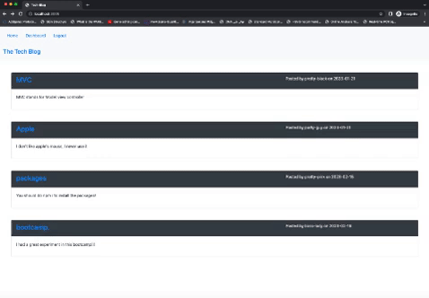

# Tech-Blog


# 14 Model-View-Controller (MVC): Tech Blog

## Your Task

Web development is such a big industry and like any other field, it has its own challenges.

The idea is to create a  Tech Blog site so all the developers who are daily creating Apps, deploying their projects and debugging the codes can share their experience and ideas by posting them to the this Tech Blog and other developers can share their opinions and experiences on those subject by commenting.

This Tech Blog site which is built based upon CMV-style, so that developers can share their ideas, experiences about technical concepts, new technologies and recent advancements by posting their blog post and commenting on other developers' posts.

This application's architectural structure should follow the MVC paradigm (Model, view & Controller) and Sequeliza as the ORM. This application also uses the express-session npm package for the authentication and for the templateing language it is using the Handlebars.js.


## User Story

```md
AS A developer who posts ideas about tech
I WANT a blog site which follows CMS-style 
SO THAT I can publish ideas and experiences in the form of articles, blog posts, and other developer be able to comment on these posts
```

## Acceptance Criteria

```md


GIVEN a CMS-style Tech blog site
WHEN for the first time I visit this site 
THEN I am able to view the homepage, which shows blog posts if any have been posted; navigation links for the homepage,a  dashboard; also the option to be able to log in
WHEN I click on the homepage option from the navigation section
THEN I am taken to the homepage of the site
WHEN I click on any other links like dashboard, etc. in the navigation section
THEN the site present a section to either sign up or sign in
WHEN I choose to sign up
THEN I am taken to a part to create a username and password
WHEN I click on the sign-up button
THEN my user credentials are saved and I am successfully logged into the Tech blog site
WHEN I revisit the site sometimes later and select to sign in 
THEN I am prompted to enter my username and password to sign in to the site
WHEN I am signed in to the site using my username and password
THEN I seeview the navigation links for the homepage, the dashboard, also the option to log out
WHEN I select the homepage in the navigation section
THEN I am taken to the homepage and able to view the already existing blog posts with individual post title and the date each had been created
WHEN I click on an existing blog post to view that individual blog post
THEN I am presented with its post title, the contents of that post, username of the person posting that post, and the date that post was created and an option to be able to comment on that post.
WHEN I am signed in, I type a comment and click on the submit button 
THEN the comment is saved automatically, this updates the post to display that that was just created with the username of the comment creator, and the date it has been created
WHEN I click on the dashboard option in the navigation section
THEN in the dashboard section I am presented with all blog posts I have already created, also an option to be able to create or add a new blog post
WHEN I click on the creat button, I am able to add a new blog post by adding both title and contents for the new blog post that I am creating
WHEN I type the title and content of new blog post, I click on the button to create it
THEN both title and contents of this new post are saved and I am taken again to an updated dashboard with my the new blog post that I just created
WHEN I click on one of my already existing posts in the dashboard section
THEN I am able to update or delete my post and again taken back to an updated dashboard and I am signed out of the Tech blog site
WHEN I am idle on the site for more than a set time
THEN I am able to view comments but I am not able to add, update, or delete comments unless I log in again 
```

## Mock-Up

To view the application functionalityplease click on the gif link below:

 

### Techniques:

 * Application’s folder structure follows the MVC (Model-View-Controller) paradigm.

    * This App uses the [express-handlebars](https://www.npmjs.com/package/express-handlebars) package to implement Handlebars.js for your Views.
    
    * Using dotenv, nmp, express-session & sequelize packages (to coonect to MySQL database)

    * Application is deployed to Heroku.


MIT License 
Copyright (c) 2023